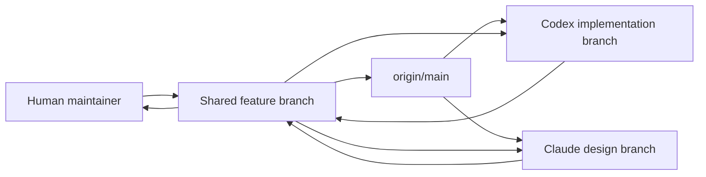

# Co-Managed Repository Flow

Memory Circle is co-managed by human maintainers, Codex, and Claude. This
document defines the shared flow so every participant works against one unified
repository instead of parallel drifting copies.

## Goals

- Keep `origin/main` as the stable integration branch.
- Keep active feature work on short-lived branches.
- Preserve each agent's work with commits before handing off.
- Rebase before publishing so remote history stays easy to read.
- Record intent, touched areas, tests, and next steps in every handoff.

## Branch Roles

```text
main
  Stable integration branch. Merge completed, reviewed feature branches here.

feature/*
  Shared feature branches for one product or technical increment.

codex/*
  Codex-owned scratch or implementation branches.

claude/*
  Claude-owned scratch or UX/design branches.
```

Use a shared `feature/*` branch only when Codex and Claude are intentionally
collaborating on the same increment. Otherwise, each agent should work on its
own `codex/*` or `claude/*` branch and merge through a feature branch.

## Standard Loop

Run this before starting work:

```bash
./scripts/repo_sync.sh
```

Then:

1. Inspect current state and recent commits.
2. Make a focused change.
3. Run the relevant tests or checks.
4. Commit the change with a clear message.
5. Run sync again.
6. Publish with:

```bash
./scripts/repo_publish.sh
```

## Handoff Format

Every handoff from a human, Codex, or Claude should include:

```text
Branch:
Latest commit:
Owner:
Intent:
Files/areas touched:
Checks run:
Known risks:
Next recommended step:
```

Keep handoffs short. The goal is enough context for the next participant to
continue without rediscovering everything.

## Multidirectional Flow



The arrows are intentionally bidirectional through Git:

- Everyone pulls from `origin/main` or the active shared `feature/*` branch.
- Codex can contribute backend, tests, docs, and structural frontend work.
- Claude can contribute product UX, copy, design refinement, and frontend polish.
- Human maintainers decide what lands in `main`.

## Conflict Protocol

When Git reports conflicts:

1. Stop and identify the conflicting files with `git status`.
2. Preserve both agents' intent unless the product decision is obvious.
3. Resolve in the smallest possible edit.
4. Run targeted tests for the conflicted area.
5. Mention the conflict and resolution in the commit or handoff.

Do not reset or discard another participant's work unless the maintainer
explicitly requests it.

## Ownership Hints

These are defaults, not hard rules:

```text
backend/api/                    Codex primary
backend/api/tests/              Codex primary
apps/mobile_desktop_flutter/    Claude primary for UX, Codex for API wiring/tests
docs/                           Shared
scripts/                        Codex primary
assets/                         Shared, commit only intentional source assets
```

## Checks

Backend:

```bash
cd backend/api
python3 -m pytest
```

Flutter, when installed:

```bash
cd apps/mobile_desktop_flutter
flutter test
```

At minimum, a handoff must say which checks were run and which were skipped.
